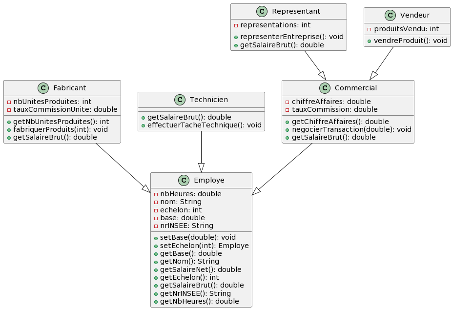

# Réponses aux questions du TP 5

## Exercice 1

1. ✅
2. ✅
3. Il y a seulement 1 changement à faire dans ``getSalaireBrut()``: ``getSalaireNet()`` se base sur la fonction précédente.
4. ✅

## Exercice 2

1. ✅
2. ✅
3. ✅
4. ✅
5. Lorsque l'on déclare un objet de type ``Employe`` avec l'instanciation en tant que ``Fabricant``, nous avons accès uniquement aux méthodes de ``Employe``. La méthode ``fabriquerProduits(int nbProduits)`` n'est alors pas accessible et les méthodes ``getSalaireBrut()`` et ``getSalaireNet()`` restent inchangées. Cependant, déclarer en tant que ``Fabricant`` permet d'utiliser ces nouvelles modifications.
6. Pour ajouter une somme fixe de 100€ au salaire brut de tous les employés, il faut ajouter ``+ 100`` dans le return de la fonction ``getSalaireBrut()`` directement dans la classe ``Employe``.

## Exercice 3

1. ✅
2. ✅
3. ✅
4. - L'avantage majeur est qu'il suffit d'une seule modification pour modifier le salaire des techniciens et des représentants en même temps (vu que le salaire brut des représentants dépendent du salaire brut des techniciens), ce qui est très pratique.
   - L'inconvénient majeur est que l'ont créé un nouvel objet ``Technicien`` à chaque appel de la fonction ``getSalaireBrut()``, ce qui est très lourd au niveau de la charge mémoire.
5. 